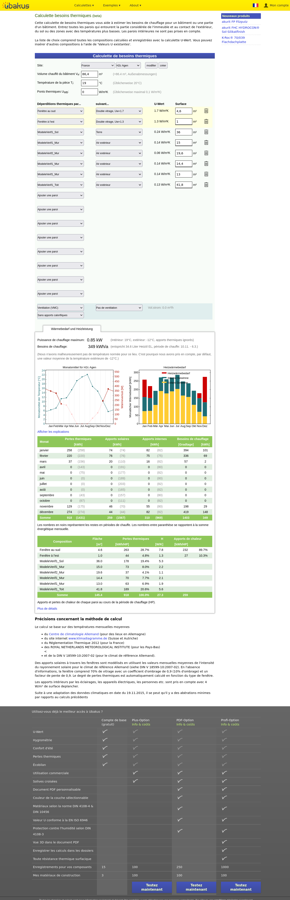

# Résultat étude de vérification Modèle 1

## choisir.poeledemasse.org

URL des résultats : 

* https://choisir.poeledemasse.org/#level=3&transparent=&livingspace=0.1&livingheight=0.1&livingvolume=86&livingvolume_auto=&wastagesurface=3&temp_indor=19&g=0.3&ubat_global=0.4&venti_global=0.08&nav-tab-record=&altitude=100&zone=a&lat=48.110949&lng=-1.66182&temp_base=-2.13&temp_base_auto=true&temp_base_years_archive=10&building-title=Mod%C3%A8le%20de%20v%C3%A9rification%201&wall-id=10&wall-name-1=Sol&wall-type-1=3.80&wall-rsi-1=0.13&wall-rse-1=0&wall-surface-1=36&wall-r-1=3.80&wall-name-5=Sud&wall-type-5=6.70&wall-rsi-5=0.13&wall-rse-5=0.04&wall-surface-5=19.6&wall-r-5=6.70&wall-name-5-window-1=Baie%20vitr%C3%A9&wall-type-5-window-1=1.7&wall-surface-5-window-1=4.6&wall-name-6=Mur%20Ouest&wall-type-6=6.70&wall-rsi-6=0.13&wall-rse-6=0.04&wall-surface-6=14.4&wall-r-6=6.70&wall-name-7=Est&wall-type-7=6.70&wall-rsi-7=0.13&wall-rse-7=0.04&wall-surface-7=14.4&wall-r-7=6.70&wall-name-7-window-1=Petite%20fen%C3%AAtre&wall-type-7-window-1=1.7&wall-surface-7-window-1=1&wall-name-8=Nord&wall-type-8=6.70&wall-rsi-8=0.13&wall-rse-8=0.04&wall-surface-8=19.6&wall-r-8=6.70&wall-name-10=Toit&wall-type-10=7.30&wall-rsi-10=0.1&wall-rse-10=0.04&wall-surface-10=41.8&wall-r-10=7.30&wall-custom-title=Mod%C3%A8le%20de%20v%C3%A9rification%201%20-%20mur&submit_input=1
* **Déperdition par conduction : 705W**
* **Déperdition par aéraulique : 7W**
* **Déperdition total : **712W****

###### Paroi : Sol (194W)

- Type : Modele vérification 1 : sol (R = 3.80 °C.m²/W)
  - Misapor (30cm, λ=0.08)
- Rsi/Rse : 0.13 /  0
- wall-surface : 36m2
- R total : 3.93°C.m²/W
- Surface opaque : 36.00m2
- Déperdition des surfaces opaques : 194W
- Déperdition total : 194W

###### Paroi : Sud (211W)

- Type  : Modèle de vérification 1 - mur (R = 6.70 °C.m²/W)
  - Paille – Botte (35cm, λ=0.052)
- Rsi/Rse : 0.13 /  0.04
- wall-surface : 19.6m2
- R total : 6.87°C.m²/W
- Fenêtre(s) Déperdition=165W : 
  - Baie vitré  Uw=1.7, Surface=4.6m2, Perte=7.82W/°C
- Surface opaque : 15.00m2
- Déperdition des surfaces opaques : 46W
- Déperdition total : 211W

###### Paroi : Mur Ouest (44W)

- Type  : Mur modèle de vérification 1 (R = 6.70 °C.m²/W)
  - Paille – Botte (35cm, λ=0.052)
- Rsi/Rse : 0.13 /  0.04
- Largeur, hauteur de la paroi : 6, 2.4m
- R total : 6.87°C.m²/W
- Surface opaque : 14m2
- Déperdition des surfaces opaques : 44W
- Déperdition total : 44W

###### Paroi : Est (44W)

- Type  : Modèle de vérification 1 - mur (R = 6.70 °C.m²/W)
  - Paille – Botte (35cm, λ=0.052)
- Rsi/Rse : 0.13 /  0.04
- wall-surface : 14.4m2
- R total : 6.87°C.m²/W
- Surface opaque : 14.40m2
- Déperdition des surfaces opaques : 44W
- Déperdition total : 44W

###### Paroi : Nord (44W)

- Type  : Modèle de vérification 1 - mur (R = 6.70 °C.m²/W)
  - Paille – Botte (35cm, λ=0.052)
- Rsi/Rse : 0.13 /  0.04
- wall-surface : 19.6m2
- R total : 6.87°C.m²/W
- Surface opaque : 19.60m2
- Déperdition des surfaces opaques : 60W
- Déperdition total : 60W

Paroi : Toit (119W)

- Type  : Modèle de vérification 1 - toit (R = 7.30 °C.m²/W)
  - Ouate de cellulose soufflée (30cm, λ=0.041)
- Rsi/Rse : 0.1 /  0.04
- wall-surface : 41.8m2
- R total : 7.44°C.m²/W
- Surface opaque : 41.80m2
- Déperdition des surfaces opaques : 119W
- Déperdition total : 119W

## Feuille resultat-damien-DEPERDITION.ods

Comparatif : 

* Avec [feuille](resultat-damien-DEPERDITION.ods) : 0.743 kW
* Avec choisirsonpdm : 0.712kW

Aménagement pour ce test :

* J'ai corrigé dans la feuille la température extérieur pour -2.13 pour coller avec mon test

## ubakus.de

https://www.ubakus.de/fr/berechnung/waermebedarf/

Aménagement pour ce test :

* -12 température de Rennes (pas de possibilité de modifier sur ubakus)
* Pas de VMC (pas trouvé comment faire double flux)

Comparatif : 

* Avec Ubakus : 0.93 kW
* Avec choisirsonpdm : 1.052kW 

Donc l'équivalent c'est plus : https://choisir.poeledemasse.org/#level=3&transparent=&livingspace=0.1&livingheight=0.1&livingvolume=86&livingvolume_auto=&wastagesurface=3&temp_indor=19&g=0.3&ubat_global=0.4&venti_global=0.2&nav-tab-record=&altitude=100&zone=a&lat=48.110949&lng=-1.66182&temp_base=-12&temp_base_auto=&temp_base_years_archive=10&building-title=Mod%C3%A8le%20de%20v%C3%A9rification%201&wall-id=10&wall-name-1=Sol&wall-type-1=3.80&wall-rsi-1=0.13&wall-rse-1=0&wall-surface-1=36&wall-r-1=3.80&wall-name-5=Sud&wall-type-5=6.70&wall-rsi-5=0.13&wall-rse-5=0.04&wall-surface-5=19.6&wall-r-5=6.70&wall-name-5-window-1=Baie%20vitr%C3%A9&wall-type-5-window-1=1.7&wall-surface-5-window-1=4.6&wall-name-6=Mur%20Ouest&wall-type-6=6.70&wall-rsi-6=0.13&wall-rse-6=0.04&wall-surface-6=14.4&wall-r-6=6.70&wall-name-7=Est&wall-type-7=6.70&wall-rsi-7=0.13&wall-rse-7=0.04&wall-surface-7=14.4&wall-r-7=6.70&wall-name-7-window-1=Petite%20fen%C3%AAtre&wall-type-7-window-1=1.7&wall-surface-7-window-1=1&wall-name-8=Nord&wall-type-8=6.70&wall-rsi-8=0.13&wall-rse-8=0.04&wall-surface-8=19.6&wall-r-8=6.70&wall-name-10=Toit&wall-type-10=7.30&wall-rsi-10=0.1&wall-rse-10=0.04&wall-surface-10=41.8&wall-r-10=7.30&wall-custom-title=Mod%C3%A8le%20de%20v%C3%A9rification%201%20-%20mur&submit_input=1

