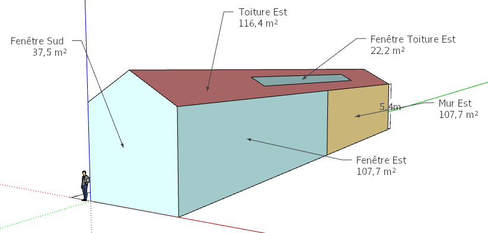
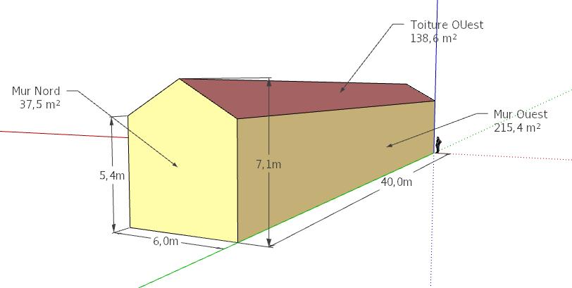

# Modèle de vérification N°2 - la maison du n'importequoi

Cas d'étude pour vérification du mode avancé de https://choisir.poeledemasse.org 

Il s'agit d'une maison "longue" de 40m x 6m, avec une pente de toit de 30°, une baie plein Sud qui remplie le mur et une fenêtre à l'Ouest (détaillé ci-après).

* Volume de l'habitat : 1296 m3
* Localisation :  Marseille
* Température extérieur de base : 1.33
* Température de consigne souhaité : 19°C
* Ventilation mécanique contrôlé double flux

## Sol / planché

* Type : Dalle en contact avec la terre
* Surface : 240m2
* Isolation : isolé avec
  * 30cm de Misapor (λ 0.08 soit R=3.8
  * 20cm de Polyrétane  (λ 0.03 soit R=6.7)

## Murs

* Tous les murs sont isolés avec : 70cm de Ouate de cellulose en panneau (λ 0.039) soit R=17.9

### Sud

* Surface total : 37,5m2
* Surface opaque : 0m2
* Fenêtre : 37,5 m2 en double vitrage Uw=1,7

### Nord

* Surface total : 37,5m2
* Fenêtre : Aucune

### Ouest

* Surface total : 215,4m2
* Fenêtre : Aucune

### Est

* Surface total : 215,4m2 
* Surface opaque : 107,7m2
* Fenêtre : 107,7m2 en double vitrage Uw=1,7

## Toiture

* Surface total : 2x138,6m2 soit 277,2m2
* Surface opaque : 255m2
* Fenêtre : 22,2m2 en double vitrage Uw=1,7
* Isolation : Non isolé, seulement des ardoises de 4mm  (λ 2) soit R=0.002

## Vues

* 3D Sketchup : [Modele_verif_2.skp](Modele_verif_2.skp)
* 2D JPEG : 
  * [Modele_verif_2_Est-Sud.png](Modele_verif_2_Est-Sud.png)
  * [Modele_verif_2_Nord_Est.png](Modele_verif_2_Nord_Est.png)

