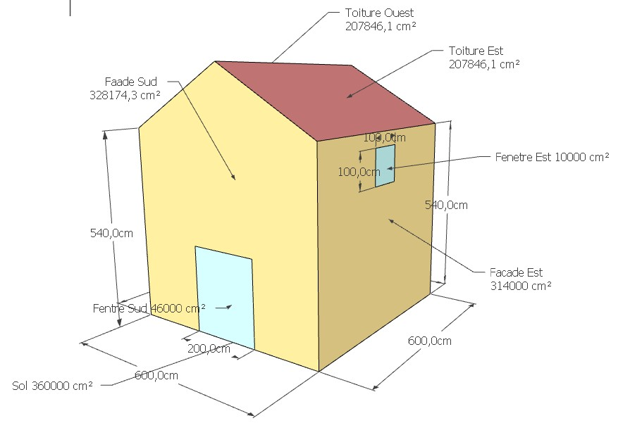
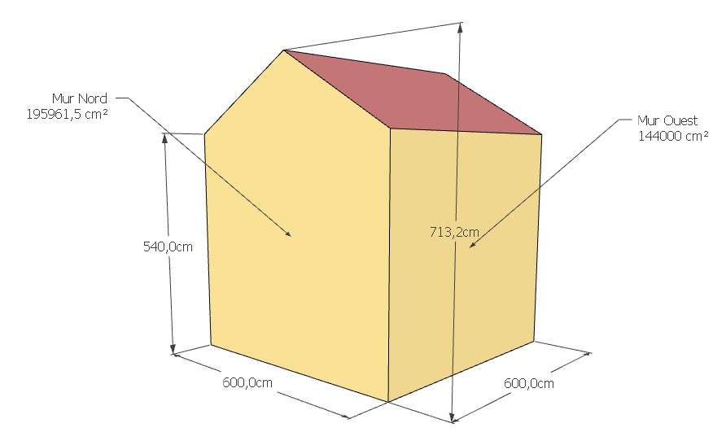

# Modèle de vérification N°4

Cas d'étude pour vérification du mode avancé de https://choisir.poeledemasse.org 

Il s'agit d'une maison identique au modèle 2 mais avec une isolation par l'intérieur (ITI) qui occasionne un pont thermique avec le plancher intermédiaire.

* Volume de l'habitat : 172m3
* Localisation :  Rennes
* Température extérieur de base : -2.13
* Température de consigne souhaité : 19°C
* Ventilation mécanique contrôlé double flux

## Sol / planché

* Type : Dalle en contact avec la terre
* Surface : 36m2 (6m x 6m)
* Isolation : isolé avec 30cm de Misapor (λ 0.08 soit R=3.8

## Murs

* Tous les murs sont isolés avec : 35cm de paille compressé (λ 0.052) soit R=6,7
* Pont thermique sur chaque longueur de mur (6m) car isolation en ITI

### Sud

* Surface total : 32.8m2
* Surface opaque : 28,2m2
* Fenêtre : 4,6m2 (2m x 2m30) en double vitrage Uw=1,7

### Nord

* Surface total : 32.8m2
* Fenêtre : Aucune

### Est

* Surface total : 31.4m2
* Fenêtre : Aucune

### Ouest

* Surface total : 31.4m2
* Surface opaque : 30,2m2
* Fenêtre : 1m2 (1m x 1m) en double vitrage Uw=1,7

## Toiture

* Surface : 2x20,9m2 soit 41,8m2
* Isolation : isolé avec 30cm de Ouate de cellulose soufflé  (λ 0.041) soit R=7,3

## Vues

* 3D Sketchup : [Modele_verif_3_3D.skb](../3/Modele_verif_3_3D.skb)

* 2D JPEG : 
  * [Modele_verif_3_Est-Sud.jpg](../3/Modele_verif_3_Est-Sud.jpg)
  * [Modele_verif_3_Ouest-Nord.jpg](../3/Modele_verif_3_Ouest-Nord.jpg)

