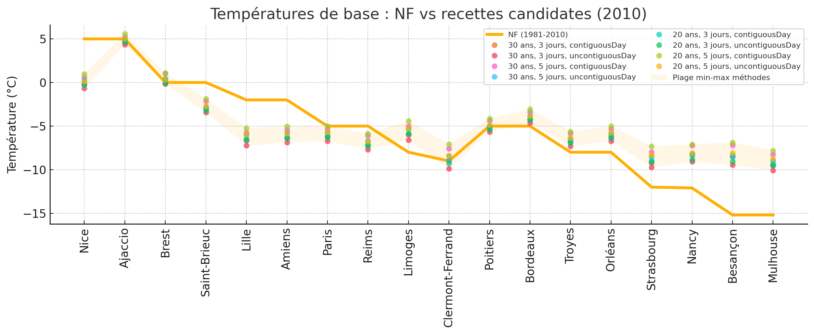

# Étude comparative des méthodes de calcul de la température de base

## Contexte

La "température de base" est la température extérieure que l’on prend comme référence dans la norme française pour dimensionner un besoin de chauffage. Jusqu’ici, je n’ai jamais réussi à connaître la méthodologie de calcul exacte malgré mes recherches auprès des institutions ([publiées en grande partie ici](https://forum.poeledemasse.org/t/methode-de-calcul-de-la-temperature-de-base/2819/5)).

Le point de départ de cette petite étude : je ne parviens pas à connaître la méthode de calcul ; la norme [NF P52‑612/CN](https://www.boutique.afnor.org/fr-fr/norme/nf-p52612-cn/systemes-de-chauffage-dans-les-batiments-methode-de-calcul-des-deperditions/fa165533/36563) ne cite que des données parfois très anciennes. Ne sachant plus trop vers qui me tourner pour connaître la source de ces valeurs, j’ai tenté une **analyse inverse** : reproduire différentes méthodes pour voir laquelle s’approche le plus de la norme.

Ayant constitué un jeu de données, j’ai ensuite creusé dans d’autres directions.

Je me suis appuyé sur le logiciel que j’ai développé pour les poêles de masse ([Choisir son PDM](https://choisir.poeledemasse.org/)). Pour cette étude, il a fallu ajouter de nouvelles fonctionnalités à l’API « température de base » (démonstration : https://framagit.org/kepon/choisirsonpdm/-/blob/main/doc/demo-temperatureBasePlus.mp4). Une version autonome est disponible pour vérifier les données : https://temperature-de-base.zici.fr/

Dans la suite, « norme NF » désigne toujours la [NF P52‑612/CN](https://www.boutique.afnor.org/fr-fr/norme/nf-p52612-cn/systemes-de-chauffage-dans-les-batiments-methode-de-calcul-des-deperditions/fa165533/36563).

Nous ne parlerons ici que du territoire français.

## Préambule

Quel impact la variation d’un degré de température de base a‑t‑elle sur le besoin de chauffage ?

- Logiciel utilisé : https://etude.poeledemasse.org
- Méthode : Ubat
- Variables : surface de déperdition et Ubat (température de consigne et autres constantes fixées)

| Surface | Ubat (W/m²·K) | Besoin à 0 °C (kW) | Besoin à 1 °C (kW) | Écart kW | Variation % |
| ------- | ------------- | ------------------ | ------------------ | -------- | ----------- |
| 40 m²   | 0.15          | 0.779              | 0.738              | 0.041    | **5.26 %**  |
| 40 m²   | 1.80          | 5.17               | 4.90               | 0.27     | **5.22 %**  |
| 200 m²  | 0.15          | 3.44               | 3.26               | 0.18     | **5.23 %**  |
| 200 m²  | 1.80          | 20.40              | 19.33              | 1.07     | **5.25 %**  |

La variation d’un degré sur la température de base modifie le besoin de chauffage d’environ **5,2 %**.

## Données

### Météo

Les données météo sont extraites du site Open‑Meteo, qui publie l’historique de données météorologiques issues de Copernicus : https://open-meteo.com/en/docs/historical-weather-api. Elles sont récupérées via l’API dédiée (https://framagit.org/kepon/choisirsonpdm/-/tree/main/api), utilisée par le logiciel https://choisir.poeledemasse.org/.

### Villes

Nous prenons deux villes par zone de la carte NF P52‑612/CN : https://choisir.poeledemasse.org/assets/img/carte-temperature-de-base.png

- **Zone A (Rouge)** : Nice (43.7034 / 7.2663 – ≈ 10 m) ; Ajaccio (41.9222 / 8.7389 – ≈ 20 m)
- **Zone B (Magenta)** : Brest (48.3903 / ‑4.4861 – ≈ 34 m) ; Saint‑Brieuc (48.5127 / ‑2.7652 – ≈ 100 m)
- **Zone C (Jaune)** : Lille (50.6292 / 3.0573 – ≈ 21 m) ; Amiens (49.8941 / 2.2959 – ≈ 61 m)
- **Zone D (Gris)** : Paris (48.8566 / 2.3522 – ≈ 35 m) ; Reims (49.2583 / 4.0321 – ≈ 80 m)
- **Zone E (Vert foncé)** : Limoges (45.8342 / 1.2627 – ≈ 200 m) ; Clermont‑Ferrand (45.7772 / 3.0870 – ≈ 358 m)
- **Zone F (Orange)** : Poitiers (46.5801 / 0.3405 – ≈ 100 m) ; Bordeaux (44.8378 / ‑0.5792 – ≈ 6 m)
- **Zone G (Bleu)** : Troyes (48.2974 / 4.0720 – ≈ 110 m) ; Orléans (47.9029 / 1.9092 – ≈ 112 m)
- **Zone H (Vert clair)** : Strasbourg (48.5734 / 7.7521 – ≈ 142 m) ; Nancy (48.6921 / 6.1844 – ≈ 220 m)
- **Zone I (Cyan)** : Besançon (47.2378 / 6.0244 – ≈ 240 m) ; Mulhouse (47.7508 / 7.3359 – ≈ 240 m)

### Récupération des données

Avec l'aide d'un script python ([baseTemperatureComparatif.py](./baseTemperatureComparatif.py)) nous explorons les variables évoquées dans mes différents échanges :

- 3 ou 5 jours les plus froids de l’année ;
- jours contigus ou non ;
- série de 20 ou 30 ans ;
- date de fin 2010 (parution de la norme) ou année courante (2025), afin de mesurer l’impact d’un dimensionnement avec des données anciennes.

Le script génère un tableau de valeurs : [baseTemperatureComparatif.csv](./baseTemperatureComparatif.csv)

Un tableur xlsx à ensuite été généré avec d'une colonne "norme NF" :  [baseTemperatureComparatif.xlsx](./baseTemperatureComparatif.xlsx)

Chaque point coloré correspond à l’une des recettes ; la ligne épaisse représente la valeur NF par ville, et la bande beige indique la plage min–max de toutes les méthodes autour de la NF.

## Analyses

### Comparaison et rétro‑ingénierie de la « température de base » NF

Nous tentons de retrouver la méthode utilisée (que personne ne semble connaître) par la norme NF. Pour cela, nous comparons chaque résultat aux températures de base fournies par la norme.

Seules les données dont la date de fin est 2010 (comme la norme) sont utilisées.

| Rang  | Recette                            | MAE (°C) | RMSE (°C) | Corr     |
| ----- | ---------------------------------- | -------- | --------- | -------- |
| **1** | **20 ans – 3 jours, non contigus** | **2.54** | **3.19**  | **0.87** |
| 2     | 30 ans – 3 jours, non contigus     | 2.55     | 3.21      | 0.87     |
| 3     | 30 ans – 3 jours, contigus         | 2.56     | 3.25      | 0.86     |
| 4     | 20 ans – 3 jours, contigus         | 2.61     | 3.28      | 0.87     |
| 5     | 30 ans – 5 jours, non contigus     | 2.58     | 3.29      | 0.86     |
| 6     | 20 ans – 5 jours, non contigus     | 2.66     | 3.37      | 0.86     |
| 7     | 30 ans – 5 jours, contigus         | 2.87     | 3.58      | 0.86     |
| 8     | 20 ans – 5 jours, contigus         | 2.99     | 3.71      | 0.86     |

**Indicateurs** :

- **MAE** (*Mean Absolute Error*) : écart moyen absolu avec la NF ;
- **RMSE** (*Root Mean Square Error*) : idem, mais pénalise davantage les grosses erreurs ;
- **Corr** : corrélation de Pearson (1 = profil identique).

#### Lecture & rétro‑ingénierie

- Les quatre premières recettes tiennent dans un mouchoir (Δ RMSE < 0,1 °C). Points discriminants :
  - Contigu vs non contigu : les versions contiguës sont ≈ 0,5 °C plus chaudes que les non contiguës → la NF étant un peu plus froide, on privilégie donc « non contigu ». 
  - Fenêtre 20 ans vs 30 ans : influence négligeable (MAE 2.54 ↔ 2.55).
- **Indice réglementaire** : de nombreux textes mentionnent « 30 dernières années ». → **30 ans – 3 jours – non contigu** reste la candidate « classique ».

#### NF vs meilleure méthode

La recette la plus proche étant « 20 ans – 3 jours non contigus », voici l’écart par ville avec la NF :

On constate des écarts très variables, de ~0 à ~6 °C. Cela s’explique probablement par la norme NF (valeur unique par département) alors que l’API fournit un point précis par ville.

#### Conclusion — Hypothèse NF

> [!IMPORTANT]
>
> Au vu des faibles écarts, il reste difficile de privilégier une méthode plutôt qu’une autre ; la MAE varie seulement de 2.54 à 2.99 °C.

Hypothèses possibles :

- Aucune méthode testée n’est totalement adaptée ;
- les données météo sources ne sont pas celles de Copernicus ;
- les séries de données utilisées par la norme se terminent bien avant 2010.

> [!IMPORTANT]
>
> **Conséquence pratique** : garder la température de base NF 2010 revient à supposer un hiver plus froid qu’aujourd’hui — on **sur-dimensionne la puissance de chauffage d’environ 12–15 %**, selon la région et la recette utilisée.

### Impact de la non mise à jour de la norme depuis 2010

Ici c'est un exercice, nous ne considérons plus les températures de la norme NF mais la différence entre les températures du jeux de donnée se terminant en 2010 et 2025. Ce qui revient à considérer quel réchauffement climatique en comparant des période allant jusqu'à 2010 ou 2025 et en retournant -20 ou -30 ans en arrière.

Nous comparerons les données avec la date de fin à 2010 et celle avec la date de fin en 2025 pour voir quel impact sur la température de base nous avons du fait que la norme NF n'a pas été mise à jour depuis 2010.

| **Recette**               | **Δ moyen (°C)** | **MAE (°C)** | **Min** | **Max** |
| ------------------------- | ---------------- | ------------ | ------- | ------- |
| 30 ans – 3 j non contigus | **+1.01**        | 1.01         | +0.21   | +1.90   |
| 30 ans – 3 j contigus     | +0.96            | 0.96         | +0.22   | +1.65   |
| 30 ans – 5 j non contigus | +0.92            | 0.92         | +0.17   | +1.74   |
| 20 ans – 3 j contigus     | +0.87            | 0.89         | +0.16   | +1.49   |
| 30 ans – 5 j contigus     | +0.86            | 0.86         | +0.27   | +1.49   |
| 20 ans – 3 j non contigus | +0.86            | 0.88         | −0.24   | +1.64   |
| 20 ans – 5 j contigus     | +0.77            | 0.78         | −0.03   | +1.28   |
| 20 ans – 5 j non contigus | +0.77            | 0.79         | −0.25   | +1.52   |

> [!NOTE]
>
> Tableau par rapport à la température NF

**La Δ moyen (°C) global est autour de +0.8°C.** Avec des variation entre -0.03 et +1.9°C  

#### Lecture rapide & hypothèse

- Réchauffement moyen : ≈ +0.8 °C entre 2010 et 2025, quelle que soit la recette.
  - Pic à +1 °C pour *30 ans – 3 j non contigus*.
  - Valeur la plus faible +0.77 °C pour *20 ans – 5 j* (contigu ou non contigu).
- Dispersion géographique : le gain varie de –0.25 °C (quelques stations côtières) à +1.9 °C (vallée du Rhône / Est).

#### Conclusion / conséquence

Sur les **12 à 15 %** de sur‑dimensionnement de puissance de chauffage imputables aux données de la norme (à ce jour non documentées, donc considérées comme incertaines), **5 à 10 %** proviennent de l’absence de mise à jour depuis 2010.

### Impact de la recette "jours contigus" vs "jour non contigus"

Concernant le nombre d’années de données, le débat restait ouvert, mais sur le choix entre jours contigus ou non contigus, les avis étaient souvent tranchés.

| Fenêtre (hist., jours) | Δ moyen (contig − non) | MAE  | Min   | Max   |
| ---------------------- | ---------------------- | ---- | ----- | ----- |
| 30 ans – 3 jours       | **+0.52 °C**           | 0.52 | +0.29 | +0.75 |
| 30 ans – 5 jours       | **+0.84 °C**           | 0.84 | +0.65 | +1.27 |
| 20 ans – 3 jours       | **+0.55 °C**           | 0.55 | +0.32 | +0.84 |
| 20 ans – 5 jours       | **+0.88 °C**           | 0.88 | +0.59 | +1.47 |

**Δ moyen (contig − non) global : +0.69°C** (données 2025 uniquement, colonne `endYearArchive=None`)

#### **Lecture rapide**

- Passer à des jours contigus élève la température de base :
  - +0.5 °C pour les fenêtres 3 jours,
  - +0.8 à +0.9 °C pour les fenêtres 5 jours.
- L’écart est toujours positif (contigu plus chaud) et atteint jusqu’à +1.5 °C pour certaines villes.

#### Conclusion

Comme attendu, la température moyenne issue des records **non contigus est plus basse** ; la différence est confirmée, avec un écart moyen d’environ **+0,7 °C** en faveur des jours contigus.

## Auteur

David Mercereau

## Licence

Beerware : https://fr.wikipedia.org/wiki/Beerware

